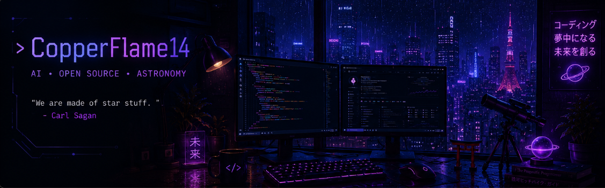

<div align="center">



<br>


</div>

---

# ```bash

$ ssh github.com/CopperFlame14

Authenticating...

██████████████████████

Connection Secure

Welcome back, Krishni.

Last Login

02:13 AM IST 🌙

```

---

<p align="center">


</p>

---

# 💻 Neofetch

```console

krishni@github

-----------------------------

OS:                 Arch Linux

Host:               VIT Chennai

Kernel:             AI & ML

Shell:              zsh

Editor:             VS Code

Languages:          Java Python C JavaScript SQL

Learning:           DSA System Design

Open Source:        GSSoC

Interests:          Astronomy Japanese Photography

Status:             Coding...

```

---

# 🌌 About

```yaml

Name: M. R. Krishni

Education:

B.Tech CSE

VIT Chennai

Focus:

AI

Machine Learning

Data Science

Software Engineering

Current Goals:

Contribute to Open Source

Master Java

500+ LeetCode Problems

Build AI Projects

```

---

# ⚡ Tech

<p align="center">


</p>

---

# 📊 GitHub Stats

<p align="center">


</p>

---

<p align="center">


</p>

---

# 📈 Activity Graph

<p align="center">


</p>

---

# 🐍 Contribution Snake

<p align="center">


</p>

---

# 📊 GitHub Metrics

<p align="center">


</p>

---

# 🚀 Current Mission

```text

[██████████] AI & Machine Learning

[█████████ ] LeetCode

[████████ ] Open Source

[███████ ] Japanese

[██████████] Astronomy

```

---

# 📌 Featured Projects

### 🏠 Smart Home Energy Analysis

Machine Learning + Clustering + Data Analytics

---

### 🌌 Cosmonova

Space-themed social platform.

---

### 🌱 Open Source

GSSoC Contributor

---

# 🌐 Connect

<p align="center">

<a href="https://github.com/CopperFlame14">


</a>

<a href="https://www.linkedin.com/in/m-r-krishni-084586320/">


</a>

<a href="https://leetcode.com/u/krishni_/">


</a>

<a href="https://www.hackerrank.com/profile/krishnimr14">


</a>

</p>

---

<div align="center">

```cpp

while(alive){

learn();

build();

fail();

improve();

repeat();

}

```

**"The best code is written when the world is asleep."** 🌙

</div>
